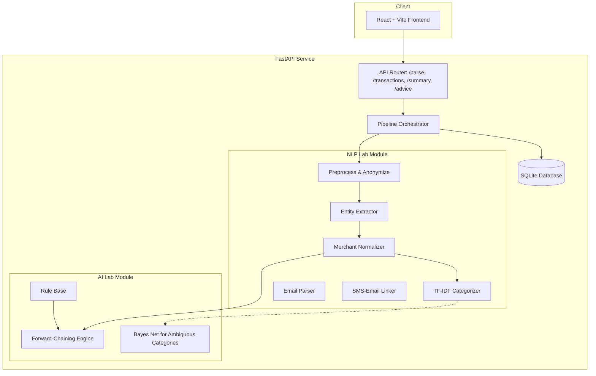

# System Architecture

```mermaid
flowchart TD
    subgraph Client
        UI[React + Vite Frontend]
    end

    subgraph Backend [FastAPI Service]
        API[API Router: /parse, /transactions, /summary, /advice]
        
        subgraph NLP_Lab [NLP Lab Module]
            PRE[Preprocess & Anonymize]
            EXT[Entity Extractor]
            NORM[Merchant Normalizer]
            CAT[TF-IDF Categorizer]
            EMAIL[Email Parser]
            LINK[SMS-Email Linker]
        end

        subgraph AI_Lab [AI Lab Module]
            FC[Forward-Chaining Engine]
            RULES[Rule Base]
            BN[Bayes Net for Ambiguous Categories]
        end

        PIPE[Pipeline Orchestrator]
        DB[(SQLite Database)]
    end

    UI --> API
    API --> PIPE
    PIPE --> PRE --> EXT --> NORM --> CAT
    CAT -.-> BN
    NORM --> FC
    RULES --> FC
    PIPE --> DB
```
